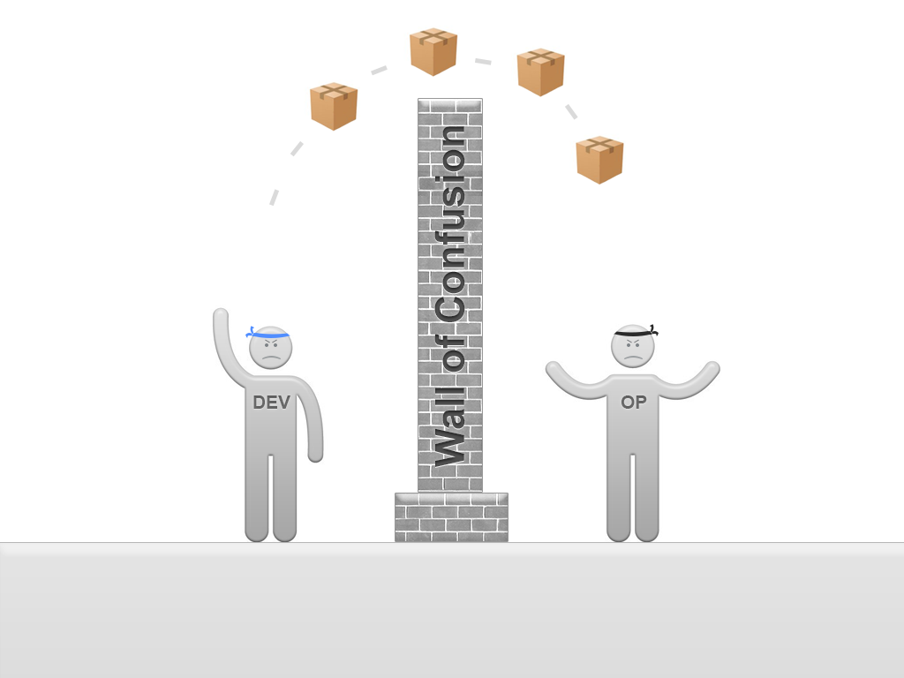

# A Brief History of
# Container Orchestration

---

## In The Beginning

 - **Developers** created applications
 - **Operations** hosted and maintained them

---


---

## Developers

* "Threw" software over the wall
* Often with little regard for complete testing or reliability

---

## Operations

* Responsible for keeping things running
* Striving for stability with software and libraries
* Constantly on call

---



---

## The Wall of Confusion

 - Long release cycles
 - Painful deployments
 - Problems with upgrades
 - Poor relations

---

# Hello DevOps!

---

## DevOps

 * Acknowledges Dev and Ops are on the same team
 * Attempts to tear down the Wall
 * **Teams** become responsible for running services

---

# ?Transition to CN?

---

## What is Cloud Native?

 - Architect applications for the Cloud - **First**
 - Design for Scalability
 - Design for Reliability
 - Assume something will go wrong

---

## Cloud Native Approach


---

 - Follow modern techniques
   - Microservices
   - Programmable infrastructure
 - Use modern technologies
   - Containers
   - Dynamic orchestration platforms

---

## Microservices


---

 - System architecture that uses multiple small services
 - Each one has a simple, well-defined job
 - As opposed to "monolithic" architectures
 - Lightweight Service-oriented architecture (SOA)
 - Composable
  - Talk over APIs
  - REST & HTTP / gRPC
 - May use multiple languages
 - Scale *OUT* as opposed to *UP*

---

## Containers


---

 - Portable format for developing and deploying applications
 - Almost synonymous with Microservices
 - Also great fit for DevOps

---

## Coordination Challenges

 - Splitting a monolith into dozens of pieces..
 - How do we manage all of these?

---

# What is Orchestration?

&nbsp;

<blockquote>
"The planning or coordination of the elements of a situation to produce a desired
effect, especially surreptitiously"
</blockquote><!-- .element: class="fragment" data-fragment-index="2" -->

Oxford English Dictionary<!-- .element: class="fragment" data-fragment-index="2" -->

---

<blockquote>
"The planning or coordination of **the elements of a situation** to produce a desired
effect, especially surreptitiously"
</blockquote>

---

## The Elements

 - Containers
 - Hosts
 - Networking

---

<blockquote>
"The planning or coordination of the elements of a situation to **produce a desired
effect**, especially surreptitiously"
</blockquote>

---

## The Desired Effect

 - Running application
 - Automatically scaling
 - Fault tolerance
   - e.g. Failover, node re-balancing, health checks
 - Efficient use of resources
 - Little manual intervention

---

<blockquote>
"The planning or coordination of the elements of a situation to produce a desired
effect, **especially surreptitiously**"
</blockquote>

---

## Surreptitiously

 - Should happen in the background
 - Complexity is hidden
 - User doesn't need to know the details

---

# Container Orchestrators

---

## Common Components

 - Container Runtime
 - Resource Manager
 - Scheduler
 - Service Discovery
 - Advanced Networking

---

## Many Options

 - Kubernetes
 - Mesos, DC/OS
 - Docker Swarm
 - Plus others
   - Nomad
   - Fleet from CoreOS (no more)
   - PaaSs...

---

# Kubernetes

---

## Background

* Open-source container orchestrator from Google
* Now part of Cloud Native Computing Foundation
* Popular and Active: >32K stars on Github

---

## Features

 - Based on Google's experience running containers
 - Bakes in various features
   - Load-balancing, secret management
 - Opinionated
   - Impact on application design

---


---

## Components

 - Nodes
 - Pods
 - Labels & Selectors
 - Services
 - ReplicaSets
 - Deployments
 - Jobs
 - Namespaces

---

## Nodes


---

 * Worker machine
 * May be a VM or physical machine
 * A Node can host one or multiple Pods
 * Include Container runtime, kubelet and kube-proxy

---

## Pods


---

 - Groups of containers deployed and scheduled together
 - Atomic unit (scaling and deployment)
 - Containers in a pod share IP address
 - Single container pods are common
 - Pods are ephemeral

---

## Flat networking space


---

 - All pods, across all hosts, are in the same network space
   - Can see each other without NAT
 - Simple cross host communication

---

## Labels


---

 - Key/Value pairs attached to objects
    - e.g: "version: dev", "tier: frontend"
 - Objects include Pods, ReplicaSets, Services
 - Label selectors then used to identify groups
 - Used for load-balancing etc

---

## Selectors


---

 - Used to query labels
   - environment = production
   - tier != frontend
 - Also set based comparisons
   - environment in (production, staging)
   - tier notin (frontend, backend)

---

## Services

 - Stable endpoints addressed by name
 - Forward traffic to Pods
 - Pods are selected by Labels
 - Round-robin load-balancing
 - Separates endpoint from implementation

---


---


---

## Types of Service

* ClusterIP (default)
* NodePort
* LoadBalancer
* ExternalName

---

## ClusterIP

 * Uses internal IP for service
 * No external exposure

---


---

## NodePort

 * Service is externally exposed via port on host
 * Same port on every host
 * Port automatically chosen or can be specified

---


---

## LoadBalancer

 * Exposes service externally
 * Implementation dependent on cloud provider

---


---

## ExternalName

 * For forwarding to resources outside of Kubernetes
   * e.g. Existing database
 * CNAME created

---

## Deployments


 - Deployments start ReplicaSets
 - Rollout/Rollback & Updates

---


---

## ReplicaSets

 * Monitor the status of Pods
   - define number of pods to run
   - start/stop pods as needed

---

## Jobs

 - Typically for performing batch processing
 - Spins up short-lived pods
 - Ensures given number run to completion

---

## Namespaces

 - Resources can be partitioned into Namespaces
 - Logical groups
 - System resources run in their own Namespace
 - Normally only use one Namespace

---


---

### More & More

 - Volumes
 - Stateful Sets
 - Ingress
 - Annotations
 - Daemon Sets
 - Horizontal Pod Autoscaling
 - Network Policies
 - Resource Quotas
 - Secrets
 - Security Context
 - Service Accounts
 - ...

---

## Dashboard

* Simple Web User Interface
* Good *high-level* overview of the cluster
* Can drill down into details
* Useful for debugging

---


---

# Kubernetes Configuration

---

## Configuring a Cluster

 - Use configuration files to manage resources
 - Specified in YAML or JSON
  - YAML tends to be more user-friendly
 - Can be combined
 - Should be stored in version control

---

## Pod Example

```
apiVersion: v1
   kind: Pod
   metadata:
     name: hello-node
     labels:
       app: hello-node
   spec:
     containers:
       - name: hello-node
         image: hello-node:v1
         ports:
           - containerPort: 8080
```

---

## Service Example

```
apiVersion: v1
kind: Service
metadata:
  name: railsapp
spec:
  type: NodePort
  selector:
    app: railsapp
  ports:
    - name: http
      nodePort: 36000
      targetPort: 80
      port: 80
      protocol: TCP
```

---

## Get Hands on!

---

### Introducting Kubectl

`kubectl` is the command line interface (CLI) tool for sending commands to a Kubernetes cluster.

We will use this tool to deploy, view, and access an application on our cluster.

---

## Step 1: Kubectl Basics

* The format of a kubectl command is:
```
kubectl [action] [resource]
```
* This performs the specified action  (like `create`, `describe`) on the specified resource (like `node`, `container`).
* Use `--help` after the command to get additional info about possible parameters
```
$ kubectl get nodes --help
```

---

Check that kubectl is configured to talk to your cluster, by running the kubectl version command:
```bash
$ kubectl version
```

You can see both the client and the server versions.

---

To view how to reach the cluster, run the `cluster-info` command:

```
$ kubectl cluster-info

Kubernetes master is running at https://35.205.211.112
GLBCDefaultBackend is running at https://35.205.211.112/api/v1/namespaces/kube-system/services/default-http-backend:http/proxy
Heapster is running at https://35.205.211.112/api/v1/namespaces/kube-system/services/heapster/proxy
KubeDNS is running at https://35.205.211.112/api/v1/namespaces/kube-system/services/kube-dns:dns/proxy
KubeRegistry is running at https://35.205.211.112/api/v1/namespaces/kube-system/services/kube-registry:registry/proxy
kubernetes-dashboard is running at https://35.205.211.112/api/v1/namespaces/kube-system/services/https:kubernetes-dashboard:/proxy
Metrics-server is running at https://35.205.211.112/api/v1/namespaces/kube-system/services/https:metrics-server:/proxy
Grafana is running at https://35.205.211.112/api/v1/namespaces/kube-system/services/monitoring-grafana/proxy
InfluxDB is running at https://35.205.211.112/api/v1/namespaces/kube-system/services/monitoring-influxdb:http/proxy
```

To further debug and diagnose cluster problems, use:
```
kubectl cluster-info dump
```

---

## Step 2: Deploy an Application

Let’s run our first application on Kubernetes with the kubectl run command. The `run` command creates a new deployment for the specified container. This is the simplest way of deploying a container.

```bash
$ kubectl run hello-kubernetes \
--image=gcr.io/google_containers/echoserver:1.4 --port=8080

deployment "hello-kubernetes" created
```

---

This performed a few things:
* Searched for a suitable node.
* Scheduled the application to run on that node.
* Configured the cluster to reschedule the instance on a new node when needed.

---

List your deployments

```bash
$ kubectl get deployments

NAME        DESIRED   CURRENT   UP-TO-DATE   AVAILABLE
hello-kubernetes   1         1         1            1
```

We see that there is 1 deployment running a single instance of your app.

---

Gather information about the status of your objects (pods, deployments, services, etc) using

```
kubectl get <object>
```
and
```
kubectl describe <object>
```

---

## Step 3: Make the App Visible

By default applications are only visible inside the cluster. We can create a proxy to connect to our application.

Start by finding out the pod name:
```
$ kubectl get pod

NAME                               READY     STATUS    RESTARTS
hello-kubernetes-624527933-nth9d   1/1       Running   0
```

---

Create a proxy for the pod

```bash
$ kubectl port-forward <POD NAME> 8080 &
```
We now have a connection between our host and the Kubernetes cluster.

---

## Step 4: Access the App

To see the output of our application, run a curl request to the local port:
```bash
$ curl http://localhost:8080

CLIENT VALUES:
client_address=127.0.0.1
command=GET
real path=/
query=nil
request_version=1.1
request_uri=http://0.0.0.0:8080/

SERVER VALUES:
server_version=nginx: 1.10.0 - lua: 10001

HEADERS RECEIVED:
accept=*/*
host=0.0.0.0:8080
user-agent=curl/7.51.0
BODY:
-no body in request-
```

---

## Step 5: Clean Up

`port-forward` is meant for testing services that are not exposed. To expose the application, use a Service (covered later).

Kill port forward
```
$ kill %2
```

Delete old Deployment
```
$ kubectl delete deployment hello-kubernetes
```

---

## Step 6: Create a new Deployment & Service

```
$ kubectl run hello --image=gcr.io/google_containers/echoserver:1.4 \
   --port=8080 \
   --expose \
   --service-overrides='{ "spec": { "type": "NodePort" } }'

service "hello" created
deployment "hello" created
```

This creates a new Deployment and Service of type:NodePort. A random high port will be allocated to which we can connect.

---

View the Service

```
$ kubectl get service

NAME               CLUSTER-IP     EXTERNAL-IP   PORT(S)          AGE
hello   			10.0.122.112   <nodes>       8080:30659/TCP   10m
```

We can see the port on which it is exposed, but what is the external IP?

---

To find the IP on which to call we need information on the nodes (use the EXTERNAL-IPs from any node):

```
$ kubectl get nodes -o wide

NAME                           STATUS                     AGE       VERSION   EXTERNAL-IP      OS-IMAGE                             KERNEL-VERSION
kubernetes-master              Ready,SchedulingDisabled   17m       v1.7.5    35.187.38.163    Container-Optimized OS from Google   4.4.52+
kubernetes-minion-group-c9bz   Ready                      17m       v1.7.5    35.189.206.159   Debian GNU/Linux 7 (wheezy)          3.16.0-4-amd64
kubernetes-minion-group-cfzx   Ready                      17m       v1.7.5    35.195.36.237    Debian GNU/Linux 7 (wheezy)          3.16.0-4-amd64
kubernetes-minion-group-ftw1   Ready                      17m       v1.7.5    35.195.61.242    Debian GNU/Linux 7 (wheezy)          3.16.0-4-amd64
```

---

Access the external IP with Curl:

```
$ curl 35.189.206.159:30659

CLIENT VALUES:
client_address=10.132.0.3
command=GET
real path=/
query=nil
request_version=1.1
request_uri=http://35.187.76.71:8080/

SERVER VALUES:
server_version=nginx: 1.10.0 - lua: 10001

HEADERS RECEIVED:
accept=*/*
host=35.187.76.71:8080
user-agent=curl/7.52.1
BODY:
-no body in request-
```

---

## Step 7: Clean Up

Delete the Deployment

```
$ kubectl delete deploy hello
```

Delete the Service

```
$ kubectl delete svc hello
```

---

## What have we Learned?

* The history of Container Orchestration.
* Basics of Kubernetes.
* How to deploy a simple application on to our own cluster.

---

[Next up, a real application!](../02_real_app.md)

