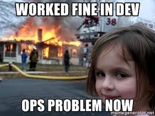
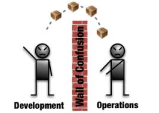
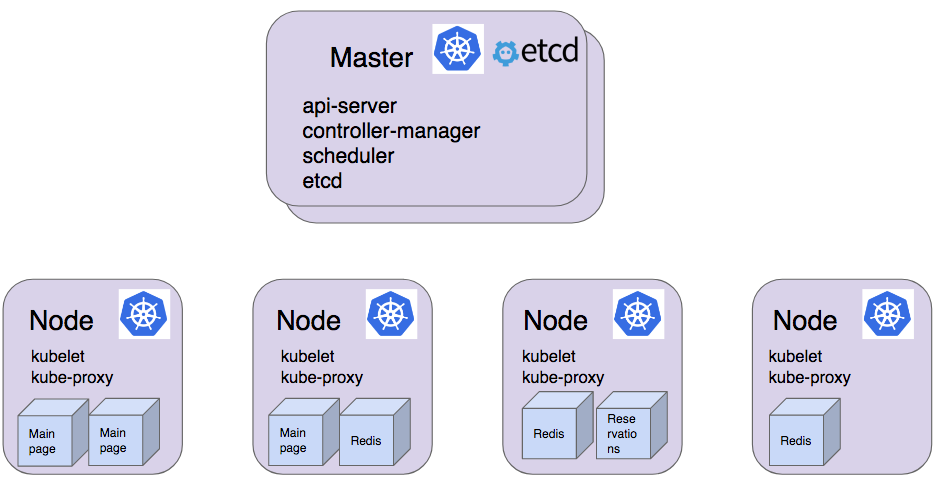
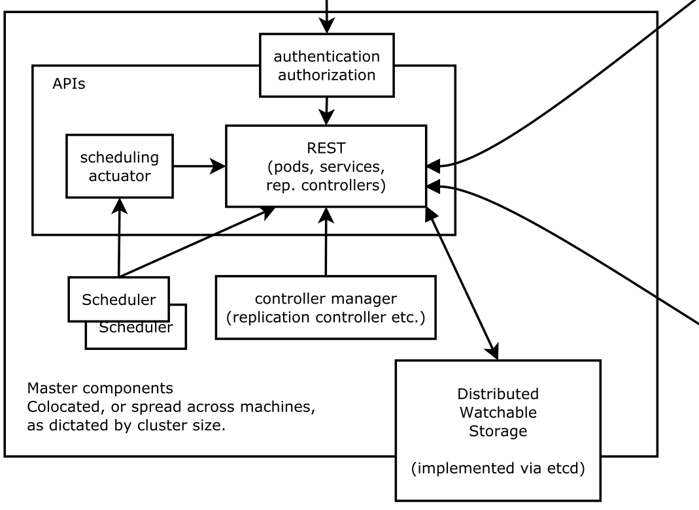
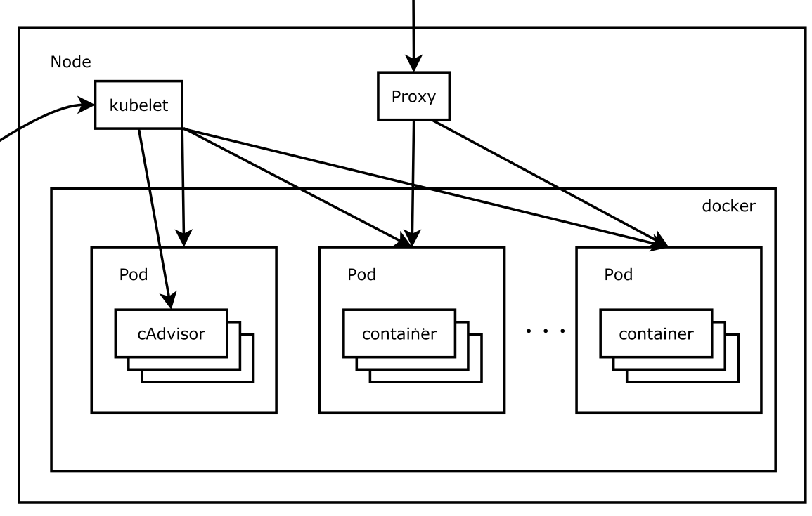

# How Did We Get Here?

---

## Overview

 - Some context...
  - Cloud Native
  - Devops
  - Microservices
  - Containers
  - Orchestration

---

## Cloud Native

 - Designing apps for the Cloud *First*
 - Designing for scalability
   - Ability to handle large numbers of users
 - And reliability
   - 5 nines etc
   - Assume failure

---

 - Using modern techniques
   - Microservices
   - Programmable infrastructure
 - And modern technology
   - containers
   - dynamic orchestration platforms

---

## DevOps

 - Traditionally
  - Developers created applications
  - Operations hosted and maintained them



---

## Lead to a "wall"

 - Developers "threw" software over the wall
  - Little regard for complete testing or reliability
 - Ops responsible for keeping things running
  - On call
  - Pushed back heavily on software/libraries



---

## Issues

 - Slow updates
 - Poor relations between dev and ops
 - Issues with upgrades/releases

---

## Devops

 - Acknowledges both dev and ops
   - are part of the same team
   - attempts to tear down the wall
 - *Teams* become responsible for running services
  - made up of both dev and ops
  - on-call

---

## Microservices

 - System architecture that uses multiple small services
 - Each one has a simple, well-defined job
 - As opposed to "monolithic" architectures
 - Lightweight SOA
 - Composable
  - Talk over APIs
  - REST and HTTP, GRPC
 - May use multiple languages
 - Scale *out* as opposed to *up*

---

## Containers

 - Portable format for developing and deploying applications
 - Almost synonymous with microservices
 - Also great fit for Devops

---

## Orchestration

 - Splitting a monolith into dozens of pieces..
 - How do we manage all of these?

---

## What is Orchestration?

&nbsp;

<blockquote>
"The planning or coordination of the elements of a situation to produce a desired
effect, especially surreptitiously"
</blockquote><!-- .element: class="fragment" data-fragment-index="2" -->

Oxford English Dictionary<!-- .element: class="fragment" data-fragment-index="2" -->

---

<blockquote>
"The planning or coordination of **the elements of a situation** to produce a desired
effect, especially surreptitiously"
</blockquote>

---

## Elements

 - Containers
 - Hosts
 - Networking

---

<blockquote>
"The planning or coordination of the elements of a situation to **produce a desired
effect**, especially surreptitiously"
</blockquote>

---

## Desired Effect

 - Running application
 - Automatically scale
 - Fault tolerant
   - failover, node rebalancing, health checks
 - Use resources efficiently
 - Little manual intervention

---

<blockquote>
"The planning or coordination of the elements of a situation to produce a desired
effect, **especially surreptitiously**"
</blockquote>

---

## Surreptitiously

<blockquote>
"In a way that attempts to avoid notice or attention; secretively"
</blockquote>

Oxford English Dictionary

---

## Surreptitiously

 - Should happen in the background
 - User doesn't need to details
 - Complexity is hidden

---

## How important is orchestration?

 - Might not need it for small apps
 - No orchestration == manual orchestration
 - Manually place containers, network, scale, check, update

---

## Common Components

 - Container Runtime
 - Resource Manager
 - Scheduler
 - Service Discovery
 - Advanced Networking

---

## Container Orchestrators

 - Kubernetes

 - Mesos

 - Docker Swarm

 - Plus others
   - Nomad, PaaSs...

---

## Kubernetes

* Open Source container orchestrator created by Google
* Now part of Cloud Native Computing Foundation (CNCF) 
* Popular: >32K stars on Github

---

## Kubernetes

 - Based on Google's experience running containers
 - Bakes in various features
   - Load-balancing, secret management
 - Opinionated
   - Impact on application design

---

## Core Concepts

 - Pods
 - Flat networking space
 - Labels & Selectors
 - Services
 - Deployments
 - ReplicaSets
 - Namespaces

---

### Architecture Diagram




---


---



---



---

### Master

* api-server
 * Provides outbound Kubernetes REST API
 * Validates requests
 * Saves cluster state to etcd

---


### Master

* controller-manager
  * Runs "control loops"
  * Regulates the state of the system
  * Watches cluster state through the apiserver
  * Changes current state towards the desired state
     - e.g. checks correct number of pods running

---


### Master

* Scheduler
  - Selects node on which to run a pod

---

### Master

* etcd

 - Distributed, consistent key-value store for shared configuration and service discovery

---


### Node

* kubelet
  * Agent that runs on each node
  * Takes a set of `PodSpecs` from API server 
  * Starts containers to fulfill specs
  * Exposes monitoring data

---


### Node

* kube-proxy
  * Implements service endpoints (virtual IPs)
  * iptables

---

## Pods

 - Groups of containers deployed and scheduled together
 - Atomic unit (scaling and deployment)
 - Containers in a pod share IP address
 - Single container pods are common
 - Pods are ephemeral

---

## Flat networking space

 - All pods, across all hosts, are in the same network space
   - Can see each other without NAT
 - Simple cross host communication

---

## Labels

 - K/V pairs attached to objects 
    - e.g: "version: dev", "tier: frontend"
 - Objects include Pods, ReplicaSets, Services
 - Label selectors then used to identify groups
 - Used for load-balancing etc

---

## Selectors

 - Used to query labels
   - environment = production
   - tier != frontend
 - Also set based comparisons
   - environment in (production, staging)
   - tier notin (frontend, backend)

---

## Services

 - Stable endpoints addressed by name
 - Forward traffic to pods
 - Pods are selected by labels
 - Round-robin load-balancing
 - Separates endpoint from implementation

---

## Service types

* ClusterIP (default)
  - Uses internal IP for service
  - No external exposure

* NodePort
  - Service is externally exposed via port on host
  - Same port on every host
  - Port automatically chosen or can be specified

---

## Service Types

* LoadBalancer
  - Exposes service externally
  - Implementation dependent on cloud provider

* ExternalName
  - For forwarding to resources outside of k8s

---

## Cluster IP Service Diagram

---

<!-- .slide: data-background="img/cluster-ip-service.png" -->

---

## NodePort Service Diagram

---

<!-- .slide: data-background="img/nodeport-service.png" data-background-size="70%"-->

---

## Service Example

```
apiVersion: v1
kind: Service
metadata:
  name: railsapp
spec:
  type: NodePort
  selector:
    app: railsapp
  ports:
    - name: http
      nodePort: 36000
      targetPort: 80
      port: 80
      protocol: TCP
```

---

## Deployments & ReplicaSets

 - ReplicaSets monitor status of Pods
   - define number of pods to run 
   - start/stop pods as needed
 - Deployments start ReplicaSets
 - Rollout/Rollback & Updates

---

<!-- .slide: data-background="img/deployments-to-containers.png" data-background-size="70%"-->

---

## Dashboard

* Simple Web User Interface

* Good *high-level* overview of the cluster

* Can drill down into details

* Useful for debugging

---

## Defining Resources

 - Used to define resources
 - Specified in YAML or JSON

---


## Example (Pod)

```
apiVersion: v1
   kind: Pod
   metadata:
     name: hello-node
     labels:
       app: hello-node
   spec:
     containers:
       - name: hello-node
         image: hello-node:v1
         ports:
           - containerPort: 8080
```


---

## Namespaces

 - Resources can be paritioned into namespaces
 - Logical groups
 - System resources run in their own namespace
 - Normally only use one namespace

---

## Jobs

 - Typically for performing batch processing
 - Spins up short-lived pods
 - Ensures given number run to completion

---

### And more

 - Annotations
 - Daemon Sets
 - Horizontal Pod Autoscaling
 - Ingress Resources
 - Namespaces
 - Network Policies
 - Persistent Volumes
 - Stateful Sets
 - Resource Quotas
 - Secrets
 - Security Context
 - Service Accounts
 - Volumes
 - ...

---

## Hands on!

---

### kubectl

`kubectl` is the command line interface (CLI) tool for sending commands to a Kubernetes cluster.

We will use this tool to deploy, view, and access an application on our cluster.

---

### Step 1 kubectl basics

* The format of a kubectl command is: 
```
kubectl [action] [resource]
```
* This performs the specified action  (like `create`, `describe`) on the specified resource (like `node`, `container`). 
* Use `--help` after the command to get additional info about possible parameters
```
$ kubectl get nodes --help
```

---

Check that kubectl is configured to talk to your cluster, by running the kubectl version command:
```bash
$ kubectl version
```

You can see both the client and the server versions.

---

To view how to reach the cluster, run the `cluster-info` command:
```bash
$ kubectl cluster-info
Kubernetes master is running at https://35.189.206.159
```

To further debug and diagnose cluster problems, use `kubectl cluster-info dump`


---

### Step 2 deploy a simple application 

Let’s run our first app on Kubernetes with the kubectl run command. The `run` command creates a new deployment for the specified container. This is the simpliest way of deploying a container.

```bash
$ kubectl run hello-kubernetes \
--image=gcr.io/google_containers/echoserver:1.4 --port=8080

deployment "hello-kubernetes" created
```

---

This performed a few things:
* Searched for a suitable node.
* Scheduled the application to run on that node.
* Configured the cluster to reschedule the instance on a new node when needed.

---

### List your deployments

```bash
$ kubectl get deployments
NAME        DESIRED   CURRENT   UP-TO-DATE   AVAILABLE   AGE
hello-kubernetes   1         1         1            1           31s
```

We see that there is 1 deployment running a single instance of your app. 

---

### Inspect your application

With 
```
kubectl get <obejct>
```
and 
```
kubectl describe <object>
```
you can gather information about the status of your objects like pods, deployments, services, etc.

---

### Step 3 View our app

By default applications are only visible inside the cluster. We can create a proxy to connect to our application.  
Find out the pod name:
```
$ kubectl get pod
NAME                               READY     STATUS    RESTARTS   AGE
hello-kubernetes-624527933-nth9d   1/1       Running   0          2m
```
Create the proxy:
```bash
$ kubectl port-forward hello-kubernetes-624527933-nth9d 8080 
```
We now have a connection between our host and the Kubernetes cluster.

---

### Accessing the application

To see the output of our application, run a curl request in a new terminal window:
```bash
$ curl http://localhost:8080
CLIENT VALUES:
client_address=127.0.0.1
command=GET
real path=/
query=nil
request_version=1.1
request_uri=http://0.0.0.0:8080/

SERVER VALUES:
server_version=nginx: 1.10.0 - lua: 10001

HEADERS RECEIVED:
accept=*/*
host=0.0.0.0:8080
user-agent=curl/7.51.0
BODY:
-no body in request-
```

---

### Expose service while creating the deployment

`kubectl port-forward` is meant for testing services that are not exposed. To expose the application, use a service (covered later).

Delete old deployment
```
$ kubectl delete deployment hello-kubernetes
```

---

Create a new **Deployment** and a **Service**

```
$ kubectl run hello --image=gcr.io/google_containers/echoserver:1.4 \
   --port=8080 \
   --expose \
   --service-overrides='{ "spec": { "type": "NodePort" } }'
service "hello" created
deployment "hello" created
```

This creates a new deployment and a service of type:NodePort. A random high port will be allocated to which we can connect.

---

View the **Service**:

```
$ kubectl get service
NAME               CLUSTER-IP     EXTERNAL-IP   PORT(S)          AGE
hello   			10.0.122.112   <nodes>       8080:30659/TCP   10m
```

We can see the port on which it is exposed, but what is the external IP?

---

To find the IP on which to call we need information on the nodes:

```
$ kubectl get nodes -o wide
NAME                           STATUS                     AGE       VERSION   EXTERNAL-IP      OS-IMAGE                             KERNEL-VERSION
kubernetes-master              Ready,SchedulingDisabled   17m       v1.7.5    35.187.38.163    Container-Optimized OS from Google   4.4.52+
kubernetes-minion-group-c9bz   Ready                      17m       v1.7.5    35.189.206.159   Debian GNU/Linux 7 (wheezy)          3.16.0-4-amd64
kubernetes-minion-group-cfzx   Ready                      17m       v1.7.5    35.195.36.237    Debian GNU/Linux 7 (wheezy)          3.16.0-4-amd64
kubernetes-minion-group-ftw1   Ready                      17m       v1.7.5    35.195.61.242    Debian GNU/Linux 7 (wheezy)          3.16.0-4-amd64
```

---

Access the external IP with curl:

```
$ curl 35.189.206.159:30659
CLIENT VALUES:
client_address=10.132.0.3
command=GET
real path=/
query=nil
request_version=1.1
request_uri=http://35.187.76.71:8080/

SERVER VALUES:
server_version=nginx: 1.10.0 - lua: 10001

HEADERS RECEIVED:
accept=*/*
host=35.187.76.71:8080
user-agent=curl/7.52.1
BODY:
-no body in request-
```

---


!! Remove this (leave for next section)

### Cleanup

```
$ kubectl delete deployment,service hello
deployment "hello" deleted
service "hello" deleted
```

---

[Next up, a real applciation...](../02_real_app.md)

