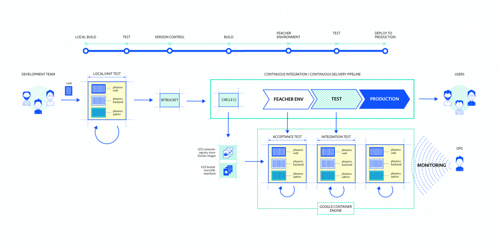
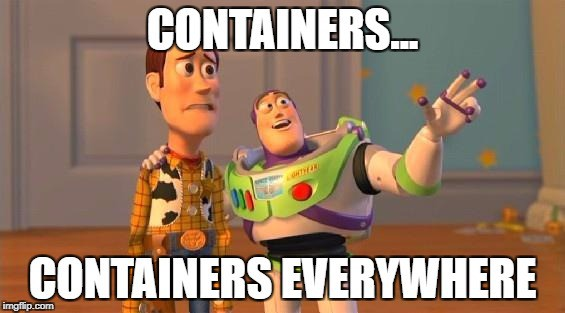

# A Brief History of
# Container Orchestration

---

---

## "Cloud Native"

* Architect applications for the Cloud - **First**
* Delivery - Minimise cycle-time, Automate deployment
* Performance - Responsiveness, Concurrency, Efficiency
* Resilience - Fault-tolerance, Self-healing
* Elasticity - Automatic scaling
* Diagnosability - Logs, Traces & Metrics
* **Assume something will go wrong**

---

# Dev & Ops

---

---

---

 * Acknowledges Dev and Ops are on the same team
 * Attempts to tear down the Wall
 * **Teams** become responsible for running services

---

# Continuous Delivery

---

---

---

* Build, Test and ship code all with the push of a button
* Development becomes more efficient, reliable and continuous
* Enable developers to safely push new features at a rapid pace
* Removes risk from the build process

---

# Microservices

---

---

---

* Architectural ideas from lightweight Service Oriented Architecture
 * services are small - fine-grained to perform a single function
 * talk over uniform APIs
* Organisational approaches like DevOps and Agile
 * embrace automation of deployment and testing
 * easing the burden on management and operations
* New technology like Containers and Programmable Infrastructure

---

# Containers

---

---

---

 - Portable format for developing and deploying applications
 - Almost synonymous with Microservices
 - Also great fit for DevOps

---

# Mission Accomplished?

---

## Coordination Challenges

 * DevOps everything
 * Code flowing from Dev to Production
 * A monolith split into dozens and dozens and dozens of pieces..
 * Containers by the boatload
 * **How do we manage all of these?**

---

# Orchestration?

---

<blockquote>
"The planning or coordination of the elements of a situation to produce a desired
effect, especially surreptitiously"
</blockquote>

<small>Oxford English Dictionary</small>

---

<blockquote>
"The planning or coordination of **the elements of a situation** to produce a desired
effect, especially surreptitiously"
</blockquote>

---

## The Elements

 - Containers
 - Hosts
 - Networking

---

<blockquote>
"The planning or coordination of the elements of a situation to **produce a desired
effect**, especially surreptitiously"
</blockquote>

---

## The Desired Effect

 - Running application
 - Automatically scaling
 - Fault-tolerance
   - e.g. Failover, node re-balancing, health checks
 - Efficient use of resources
 - Little manual intervention

---

<blockquote>
"The planning or coordination of the elements of a situation to produce a desired
effect, **especially surreptitiously**"
</blockquote>

---

## Surreptitiously

 - Should happen in the background
 - Complexity is hidden
 - User doesn't need to know the details

---

# Container Orchestrators

---

## Common Components

 - Container Runtime
 - Resource Manager
 - Workload Scheduler
 - Service Discovery
 - Networking

---

## Many Options

 - Kubernetes
 - Mesos, DC/OS
 - Docker Swarm
 - Plus others
   - Nomad
   - Fleet from CoreOS (no more)
   - PaaSs...

---

[Next up, Kubernetes!](../02_kubernetes.md)
