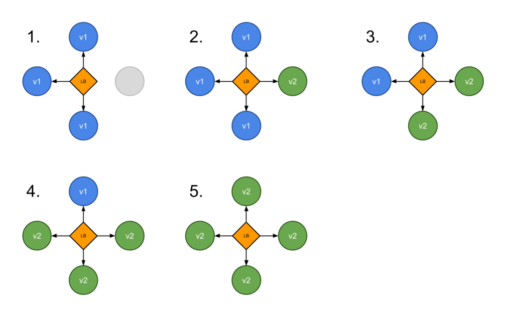
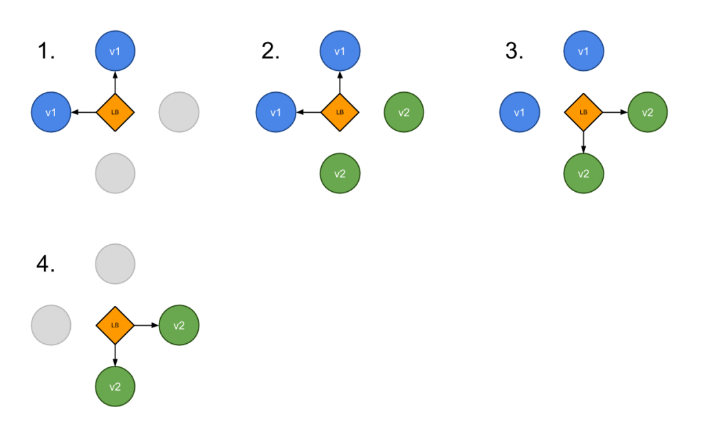
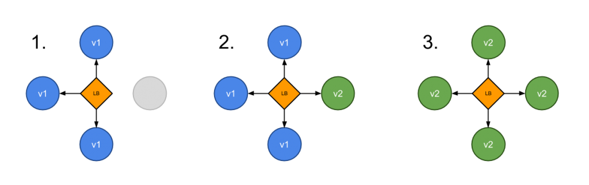

# Advanced Features

---

We now have a 'real life' application deployed and running. We have added the necessary pieces to consider this 'production ready'.

---

## In this section we will cover

- Storage / Volumes
- Ingress
- Autoscaling
- Advanced Deployments

---

### Storage

 - A Pod is made up of one or more containers and data volumes that can be mounted inside the containers.
 - In this section you will learn how to:

* define a deployment backed by a emptyDir
* define a deployment backed by a emptyDir(memory backed storage)
* define a deployment backed by a persistent volume and persistent volume claim
* define a deployment backed by a persistent volume and persistent volume claim using a StorageClass

---

### Volumes

Volumes are means to save data, as well as share it between containers. Any volumes in a pod are accessible by all containers running inside that same pod. The data is persisted across container restarts.

There are a large number of implementations to back the storage. From local options such as `hostPath`, cloud specific options such as `awsElasticBlockStore`, distributed storage such as `ceph` or `nfs`, and many many more.

---

### emptyDir

* In this exercise we will demonstrate the use of an emptyDir as a volume.

---

 * The volume is of type `emptyDir`.
 * The kubelet will create an empty directory on the node when the Pod is scheduled.
 * Once the Pod is destroyed, the kubelet will delete the directory.

---

Find the `pod-empty-dir.yaml` file in the `./real-app/` folder

```
apiVersion: v1
kind: Pod
metadata:
  name: busybox
spec:
  containers:
  - name: busy
    image: busybox
    volumeMounts:
    - name: test
      mountPath: /busy
    command:
      - sleep
      - "3600"
  - name: box
    image: busybox
    volumeMounts:
    - name: test
      mountPath: /box
    command:
      - sleep
      - "3600"
  volumes:
  - name: test
    emptyDir: {}
```

---

Apply the configuration file:

```
kubectl apply -f ./real-app/pod-empty-dir.yaml
```

This create a single pod with two containers and one volume.

---

Once the pod is deployed, `exec` into one of the containers:

```
$ kubectl exec -ti busybox -c box /bin/sh
#
```

Now create a new file in the `/box` directory:

```
$ touch /box/foobar
$ ls /box
```

---

Exit from the container and exec into the second:

```
#exit
$ kubectl exec -ti busybox -c busy
#
```

List the contents of the `/busy` directory

```
#ls -l /busy
total 0
-rw-r--r--    1 root     root             0 Nov 19 16:26 foobar
```

Note that this works in both directions. But once the pod dies, the directory is removed.

---

### Persistent Volumes

While handling volumes with a persistent volume definition and abstracting the storage provider using a claim is powerful, an administrator of the cluster still needs to create those volumes in the first place.

---

## Dynamic Provisioning
Alternatively a `StorageClass` can be configured to dynamically provision Persistent Volumes (PV).  User requests a Persistent Volume Claim (PVC), and the provisioner defined in the StorageClass will dynamically create the volume.

---

Here is an example of a StorageClass on AWS:

```
kind: StorageClass
apiVersion: storage.k8s.io/v1
metadata:
  name: slow
provisioner: kubernetes.io/aws-ebs
parameters:
  type: io1
  zones: us-east-1d, us-east-1c
  iopsPerGB: "10"
```
---

GKE comes with a default StorageClass that will dynamically provision persitent disks on demand. We can see this by running:

```
$ kubectl get storageclass
...
$ kubectl describe storageclass standard
...
```

---

First we create a persistent volume claim including the above storage class. (This file can be found at `./real-app/persistent-volume.yaml`). Be sure to replace the <MY_SC_CLAIM>.

```
kind: PersistentVolumeClaim
apiVersion: v1
metadata:
  name: <MY_SC_CLAIM>
  annotations:
    volume.beta.kubernetes.io/storage-class: "standard"
spec:
  accessModes:
    - ReadWriteOnce
  resources:
    requests:
      storage: 2Gi
```

---

Let's create the claim and then verify that a persistent volume is created automatically. It should be bound to the claim requesting storage.

```
$ kubectl create -f real-app/persistent-volume.yaml
$ kubectl get pv
$ kubectl get pvc
```

---

Finally, if we delete the persistent volume claim, we can see the volume gets released and is automatically deleted

```
$ kubectl delete pvc <MY_SC_NAME>
$ kubectl get pv
```

---

### Do it yourself

* Our sample app currently is writing logs to `/var/log/app.log`
* Create a Persistent Volume Claim to persist logs.
* Update the exiting deployment to use the PVC.
* Verify the logs are persisted (even after the application dies)

---

### Cheat

```
kind: PersistentVolumeClaim
apiVersion: v1
metadata:
  name: logclaim
spec:
  accessModes:
    - ReadWriteOnce
  resources:
    requests:
      storage: 8Gi
```

---

```
...
    volumeMounts:
    - name: logs
      mountPath: /var/log
  volumes:
    - name: logs
      persistentVolumeClaim:
        claimName: logclaim
```

---

### Ingress

Typically, services and pods have IPs only routable by the cluster network. All traffic that ends up at an edge router is either dropped or forwarded elsewhere. Conceptually, this might look like:
```
    internet
        |
  ------------
  [ Services ]
```

---

An Ingress is a collection of rules that allow inbound connections to reach the cluster services.
```
    internet
        |
   [ Ingress ]
   --|-----|--
   [ Services ]
```

---

It can be configured to:
* Give services externally-reachable urls
* Loadbalance traffic
* Terminate SSL
* Offer name based virtual hosting

An Ingress controller is responsible for fulfilling the Ingress, usually with a loadbalancer, though it may also configure your edge router or additional frontends to help handle the traffic in an HA manner.

---

### Ingress controller

In order for the Ingress resource to work, the cluster must have an `Ingress Controller` running.

An `Ingress Controller` is a daemon, deployed as a Kubernetes Pod, that watches the ApiServer's /ingresses endpoint for updates to the Ingress resource. Its job is to satisfy requests for ingress or configures a Cloud LoadBalancer such as ELB or Google Cloud LoadBalancer.

---

### Ingress Workflow

* Poll until apiserver reports a new Ingress.
* Hosted LB:
  * Write the LB config file based on a go text/template.
  * Reload LB config.
* Cloud LB:
  * Update configuration

---

### Example
Ingress resource
```
apiVersion: extensions/v1beta1
kind: Ingress
metadata:
  name: frontend-ingress
spec:
  rules:
    - host: frontend.example.com
      http:
        paths:
          -
            backend:
              serviceName: front-end
              servicePort: 80
            path: /
```
*POSTing this to the API server will have no effect if you have not configured an Ingress controller.*

---

### Ingress Controllers

There are multiple Ingress controllers we can use, including nginx, HAProxy or Traefik. However there are some subtle differences between them.

Our cluster has Google's L7 ingress controller already installed.

---

### Deploy some application

First we need to deploy some application to publish. To keep this simple we will use the echoheaders app that just returns information about the http request as output.
```
kubectl run echoheaders --image=gcr.io/google_containers/echoserver:1.4 \
  --replicas=1 --port=8080
```
Now we expose the same application in two different services (so we can create different Ingress rules).
```
kubectl expose deployment echoheaders --type=NodePort --port=80 \
  --target-port=8080 --name=echoheaders-x
kubectl expose deployment echoheaders --type=NodePort --port=80 \
--target-port=8080 --name=echoheaders-y
```

---

### Add ingress rules (in `./real-app/ingress-echo.yaml`)

```
  rules:
    - host: foo.bar.com
      http:
        paths:
          - path: /foo
            backend:
              serviceName: echoheaders-x
              servicePort: 80
    - host: bar.baz.com
      http:
        paths:
          - path: /bar
            backend:
              serviceName: echoheaders-y
              servicePort: 80
          - path: /foo
            backend:
              serviceName: echoheaders-x
              servicePort: 80
```

---


```
kubectl create -f ./real-app/ingress-echo.yaml
```

Note this may take a few minutes spin up.

Wait until you see an IP under the `ADDRESS` via `kubectl get ingress`

---

### Accessing the application

To access the applications via a browser you need either to edit your `/etc/hosts` file with the domains `foo.bar.com` and `bar.baz.com` pointing to the IP of your k8s cluster. Or use a browser plugin to manipulate the host header.

Here we'll use `curl`.

```
curl -H "Host: foo.bar.com" http://<INGRESS_ADDRESS>/bar
curl -H "Host: bar.baz.com" http://<INGRESS_ADDRESS>/bar
curl -H "Host: bar.baz.com" http://<INGRESS_ADDRESS>/foo
```

---

### Do it yourself

* Expose our application via Ingress.
* Write an ingress manifest to expose the front-end service on port 80 listening on pgk.example.com/demo
* Access the application via `curl` or a browser on port 80.

---

## Auto Scaling

As we have seen in the previous section scaling our applications is very simple using kubectl. However, ideally this would not be a manual action.

Kubernetes supports this via the `HorizontalPodAutoscaler` resource.

---

## HorizontalPodAutoscaler (HPA)

* Periodically fetches metrics (default 30 seconds)
* Compares to user specified target value.
* Adjusts the number of replicas (pods) of a Deployment if needed.
* CPU usage is built in.
* Fetched from Heapster.
* Can also read Prometheus (for custom metrics)

---


---

### Adding an HPA

We can add an HPA to our existing Deployment

./real-app/pod-auto-scaler.yaml

```
apiVersion: autoscaling/v1
kind: HorizontalPodAutoscaler
metadata:
  name: pgk-hpa
spec:
  scaleTargetRef:
    kind: Deployment
    name: pgk-back-deployment
  minReplicas: 1
  maxReplicas: 5
  targetCPUUtilizationPercentage: 50
```

---

We can create this resource on the cluster just as we have done with the others:

```
$ kubectl apply -f ./real-app/pod-auto-scaler.yaml
```

And view the resource with `kubectl get` and `kubectl describe`

---

### Testing the HPA

In order to test that the HPA works as expected we will need our application to consume > 80% CPU. Luckily our application has a very CPU intensive endpoint (`/mineBitcoin`).

---

Make a request (or several) to the endpoint `/mineBitcoin` (note this endpoint can take a query parameter `seconds`).

See if your Deployment scales successfully.

---

### Advanced Deployments

Kubernetes offers a variety of ways to release an application.

The correct option depends on your specific requirements and use case.

In this section we will look at several options.

---

## Deployment Strategies

- **Recreate**: Terminate the old version then release a new one
- **Ramped**: Release a new version via a rolling update
- **Blue/Green**: Release a new version alongside the old version then switch traffic
- **Canary**: Release a new version to a subset of users, then proceed to a full roll-out
- **A/B testing**: release a new version to a subset of users in a precise way (HTTP headers, cookie, weight, etc.).

---

## Recreate

---

* Best for Development environments
* Terminates all the running instances then recreates them with the newer version

```
spec:
  replicas: 3
  strategy:
    type: Recreate
```

---

### Pros
* Application state entirely renewed

### Cons
* Downtime that depends on both shutdown and boot duration of the application

---

## Ramped

---

* When you need a slow rollout
* Updates pods in a rolling update fashion, a secondary ReplicaSet is created with the new version of the application, then the number of replicas of the old version is decreased and the new version is increased until the correct number of replicas is reached.
* You can specify maxUnavailable and maxSurge to control the rolling update process

---



---

```
spec:
  replicas: 3
  strategy:
    type: RollingUpdate
    rollingUpdate:
      maxSurge: 2        # how many pods we can add at a time
      maxUnavailable: 0  # maxUnavailable define how many pods can be unavailable
                         # during the rolling update
```

---

### Pros
* Version is slowly released across instances
* Convenient for stateful applications that can handle rebalancing of the data

### Cons
* Rollout/rollback can take time
* Supporting multiple APIs is hard
* No control over traffic

---

## Blue/Green

---

* Best to avoid API versioning issues
* Differs from a ramped deployment because the “green” version of the application is deployed alongside the “blue” version
* After testing that the new version meets the requirements, update the Kubernetes Service object that plays the role of load balancer to send traffic to the new version by replacing the version label in the selector field

---



---

```
apiVersion: v1
kind: Service
metadata:
 name: my-app
 labels:
   app: my-app
spec:
 type: NodePort
 ports:
 - name: http
   port: 8080
   targetPort: 8080

 # Note here that we match both the app and the version.
 # When switching traffic, we update the label “version” with
 # the appropriate value, ie: v2.0.0
 selector:
   app: my-app
   version: v1.0.0
```

---

### Pros
* Instant rollout/rollback
* Avoid versioning issue, change the entire cluster state in one go

### Cons
* Requires double the resources
* Proper test of the entire platform should be done before releasing to production
* Handling stateful applications can be hard

---

## Canary

---

* Let the consumer do the testing
* Routing a subset of users to a new functionality
* Can be done using two Deployments with common pod labels.
  * One replica of the new version is released alongside the old version.
  * Then after some time and if no error is detected, scale up the number of replicas of the new version and delete the old deployment
* Requires spinning-up as many pods as necessary to get the right percentage of traffic

---



---

### Pros
* Version released for a subset of users
* Convenient for error rate and performance monitoring
* Fast rollback

### Cons
* Slow rollout
* Fine tuned traffic distribution can be expensive (99% A/ 1%B = 99 pod A, 1 pod B)

---

## A/B testing

---

* Best for feature testing on a subset of users
* Actually a technique for making business decisions based on statistics, rather than a deployment strategy
* However, it is related and can be implemented using a canary deployment
* In addition to distributing traffic amongst versions based on weight, you can precisely target a given pool of users based on a few parameters (cookie, user agent, etc.)
* This technique is widely used to test conversion of a given feature and only rollout the version that converts the most

---


---

### Pros
* Requires intelligent load balancer
* Several versions run in parallel
* Full control over the traffic distribution

### Cons
* Hard to troubleshoot errors for a given session, distributed tracing becomes mandatory
* Not straightforward, you need to setup additional tools
  * e.g. Istio, Linkerd, Traefik, NGINX, HAProxy
---

## In Summary

* Development/Staging environments: Recreate or Ramped deployment is usually a good choice
* Production: Ramped or Blue/Green deployment is usually a good fit
* Not confident with the stability of the platform? A canary release should be the way to go
* Business requires testing of a new feature amongst a specific pool of users? A/B testing

---

## What have we Learned?

- How to persist data in the cluster using Volumes
- How to expose your application with an Ingress
- Autoscaling
- Advanced Deployments strategies

---

[Next up Setting up an HA cluster](../06_cluster.md)
