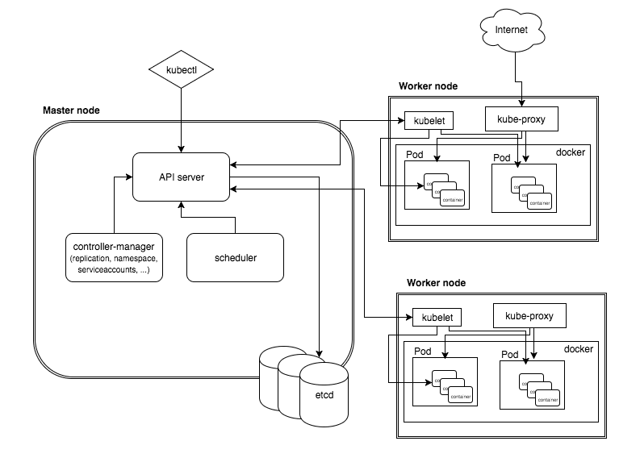

## High Availability
## And Multi Region
##  Kubernetes

---

### Highly Available

Why do we want out systems to be Highly Available?

---

"Everything fails, all the time"

-Werner Vogels

---

### Highly Available

What does HA even mean?

---

_High availability is a characteristic of a system, which aims to ensure an agreed level of operational performance, usually uptime, for a higher than normal period._

-Wikipedia

(This sounds a bit vague)

---

When we talk about systems which are Highly Available we mean that there should be no **single point of failure**

What are the potential single points of failure in a Kubernetes cluster? 

---

Kubernetes Architecture



---

### HA Kubernetes

**Master**
* API Server
* Controller Manager*
* Scheduler*

*Will perform leader election (given the `--leader-elect` flag)

---

### HA Kubernetes

**Etcd**

* Etcd maintains the state of our cluster. This is crucial to maintain high availability.

* We can accomplish by creating a (minimum) 3 node Etcd cluster.

* We can also use persistent storage (e.g. on a cloud provider) to ensure no data is lost.

---


---


### To co-locate Masters and Etcd nodes?

This is a trade off between managing/paying for more instances vs isolation.

---

## Load Balancing the API Server

* Need to handle master failure
* Kube-proxies need to point to API Server
* kubectl (or any other integration as well)

---

Common HA Setup on the Cloud

Spread across 3 regions

---

## How to setup a Highly Available Kubernetes cluster?

---

Easy :)

```
$ gcloud container clusters create enexis-test
```

---


Failover scenarios

---

## Multi Region
## Kubernetes

Option #1 - Create a cluster which spans multiple 
Option #2 - Multiple clusters

---

### Kubernetes
### Federation

...

---

## Setting up a 
## Kubernetes 
## Cluster

---

### In this section we will 

* Look at options for running Kubernetes
* Set up our own HA Kubernetes cluster
* Deploy Sock Shop
* Integrate AWS Services
* Integrate our Deals service
* Visualize and monitor our application

---

There are **many** options for running Kubernetes

* Manual
* Terraform / Ansible
* kops
* kube-adm
* Tectonic
* Hosted (GKE, ACS, and soon EKS!)
* Openshift
* ...

---

### Depends on your needs

* Are you running in the cloud or onprem?
* Do you have dedicated infra/ops team?
* What are your security requirements?
* Do you like to do things the hard way :)?

---

### AWS Specific Considerations

Kubernetes is mostly agnostic of the underlying infra.

 * Permissions
 * Networking
 * Storage
 * Scaling
 * AWS Services

---

### Permissions

**IAM Roles**

Needed by tools setting up the infrastructure (e.g. kops)

Also for any pods which will want to call the AWS API directly. For example to access an s3 bucket.

This can be used with the AWS IAM integration by putting annotations on Kubernetes resources:

```
  annotations:
        iam.amazonaws.com/role: myapp-iam-role
```

This is not native to Kubernetes, but part of an add-on

---

### Networking

**Route53** - Can be used as External DNS for exposing Kubernetes Services and Ingresses

**Virtual Private Clouds (VPCs)** - Kubernetes cluster will run within a single VPC. Can create one specifically for our cluster or use an existing one.

---

### Storage

**ElasticBlockStorage**

Kubernetes natively supports Volumes backed by EBS.

```
  volumes:
  - name: sample-volume
    awsElasticBlockStore:
      volumeID: <volume-id>
      fsType: ext4
```


_This EBS Volume must exist beforehand._

---

### Storage

**Dynamic Provisining**

We can also use the built-in StorageClass for EBS to provide dynamic provisioning of Persistent Volumes.

```
kind: StorageClass
apiVersion: storage.k8s.io/v1
metadata:
  name: standard
provisioner: kubernetes.io/aws-ebs
parameters:
  type: gp2
reclaimPolicy: Retain
mountOptions:
  - debug
```

---

### Scaling

**Cluster Autoscaler**

Requires an AWS autoscaling group and necessary IAM roles.

An AWS autoscaler is provided in the Kubernetes repo [here](https://github.com/kubernetes/autoscaler/blob/master/cluster-autoscaler/cloudprovider/aws/README.md)

---

### Kops

An opinionated provisioning system. Kops has been incorporated within the Kubernetes project and provides:

* Fully automated installation
* Highly Available Cluster setup
* Terraform manifest generation (optional)
* Self-healing clusters
* Support for AWS and GCE

---

### This just in: EKS!

Amazon has just announced (a managed Kubernetes service)[https://aws.amazon.com/eks/]. 

Joining the other major cloud providers (Google and Microsoft) we now have:

* Google Container Engine (GKE)
* Azure Container Service (ACS)
* AWS Elastic Container Service for Kubernetes (EKS)

---


---


---

### EKS

* Still in very early days (beta)
* Will be the way forward on AWS
* Kops still provides more flexibility

---

### Exercise - setting up a 
### fully HA cluster on AWS
###    with Kops

We will use `kops` to setup a Kubernetes cluster.

You can view the kops documentation on [GitHub](https://github.com/kubernetes/kops/)

---

Log-in to the Cloud VM

ssh csuser@[IP]

---

Some setup

```bash
$ sudo chown csuser /home/csuser
$ export KOPS_STATE_STORE=s3://enexis-k8s
```

---

Generate an ssh keypair

```
$ mkdir .ssh
$ ssh-keygen -t rsa
Generating public/private rsa key pair.
Enter file in which to save the key (/root/.ssh/id_rsa):
Enter passphrase (empty for no passphrase):
Enter same passphrase again:
Your identification has been saved in /root/.ssh/id_rsa.
Your public key has been saved in /root/.ssh/id_rsa.pub.
The key fingerprint is:
...
```

---

Create the cluster configuration

```
$ kops create cluster --zones eu-west-1c enexis.user<X>.k8s.local
```

Or HA version

```
$ kops create cluster --node-count 3 --zones eu-west-1a,eu-west-1b,eu-west-1c --master-zones eu-west-1a,eu-west-1b,eu-west-1c --node-size t2.medium --master-size t2.small enexis.user12.k8s.local
```

View and verify the output. You can modify the configuration by running

```
$ kops edit cluster enexis.user<X>.k8s.local
```

---

Once you are happy with the config you can create the cluster by running

```
$ kops update cluster goto.user<X>.k8s.local --yes
```

This will take a few minutes to create... (coffee anyone?) we can then verify the cluster is up and healthy

```
$ kops validate cluster
```

---

And kubectl should be configured to point to our new cluster

```
$ kubectl cluster-info
```

---

### Run the Sock Shop

Read the documentation located at: https://microservices-demo.github.io/microservices-demo

```bash
$ git clone https://github.com/microservices-demo/microservices-demo.git

$ kubectl create ns sock-shop
$ kubectl apply -f microservices-demo/deploy/kubernetes/complete-demo.yaml
```

---

## Exercise #1

* Modify the front-end service of the Sock Shop to be of type LoadBalancer.

* Then access the application via the public dns name.

* Buy some socks!

---

## Exercise #2

 * Modify one of the stateful services to use AWS EBS

 * Setup one with a static Persistent Volume

 * Setup another using the Dynamic Storage class

---

## Exercise #3

Deploy the Deals service alongside the Sock Shop (hint: namespace)
* Add a deployment
* Add a service to expose it (on port 80)

Then update the front-end deployment to point to the image:  icrosby/front-end:v1

---

## Exercise #4
## Chaos Monkey

Start killing things, and see how the cluster and application reacts.

---

## RBAC

---

### A bit about roles

Role Based Access Control (RBAC) is a common approach to managing users’ access to resources or operations.

Permissions specify exactly which resources and actions can be accessed. 

The basic principle is: instead of separately managing the permissions of each user, permissions are given to roles, which are then assigned to users, or better - groups of users.

---

### Roles Bundle Permissions

- Managing permissions per user can be a tedious task when many users are involved. 
- As users are added to the system, maintaining user permissions becomes harder and more prone to errors. 
- Incorrect assignment of permissions can block users’ access to required systems, or worse - allow unauthorized users to access restricted areas or perform risky operations.

---

* A regular user can only perform a limited number of actions (e.g. get, watch, list). 
* A closer look into these user actions can reveal that some actions tend to go together e.g. checking logs.
* Once roles are identified and assigned to each user, permissions can then be assigned to roles, instead of users. 

Managing the permissions of a small number of roles is a much easier task.

---

### Basic concepts

**Rule**: grants permission
* Applies to resource types
* Grants verbs (create, edit, view, delete)

* (Cluster)Role
  * Cluster wide / within a namespace
  * List of rules

* (Cluster)RoleBinding
  * Connects (Cluster)Role to User
  * Both human & service account

---

### API overview

The RBAC API declares four top-level types which will be covered in this section:
* Role
* ClusterRole
* RoleBinding
* ClusterRoleBinding

---

### Role
A `Role` contains rules that represent a set of permissions. Permissions are additive (there are no “deny” rules). 

A `Role` can be defined within a namespace, or cluster-wide (`Role` vs `ClusterRole`)

---

Here’s an example `Role` in the “default” namespace that can be used to grant read access to pods:

```
kind: Role
apiVersion: rbac.authorization.k8s.io/v1beta1
metadata:
  namespace: default
  name: pod-reader
rules:
- apiGroups: [""] # "" indicates the core API group
  resources: ["pods"]
  verbs: ["get", "watch", "list"]
```

---

### Cluster Role

* A `ClusterRole` can be used to grant the same permissions as a `Role`, but because they are cluster-scoped, they can also be used to grant access to:
* cluster-scoped resources (like nodes)
* namespaced resources (like pods) across all namespaces

---

### Cluster Role

The following ClusterRole can be used to grant read access to secrets in any particular namespace, or across all namespaces

```
kind: ClusterRole
apiVersion: rbac.authorization.k8s.io/v1beta1
metadata:
  # "namespace" omitted since ClusterRoles are not namespaced
  name: secret-reader
rules:
- apiGroups: [""]
  resources: ["secrets"]
  verbs: ["get", "watch", "list"]
```

---

### RoleBinding

A role binding grants the permissions defined in a role to a user

Permissions can be granted within a namespace with a `RoleBinding`, or cluster-wide with a `ClusterRoleBinding`.

---

A `RoleBinding` may reference a `Role` in the same namespace. The following `RoleBinding` grants the “pod-reader” role to the user “jane” within the “default” namespace. 

```
# This role binding allows "jane" to read pods in the "default" namespace.
kind: RoleBinding
apiVersion: rbac.authorization.k8s.io/v1beta1
metadata:
  name: read-pods
  namespace: default
subjects:
- kind: User
  name: jane
  apiGroup: rbac.authorization.k8s.io
roleRef:
  kind: Role
  name: pod-reader
  apiGroup: rbac.authorization.k8s.io
```

---

In this example, even though the following RoleBinding refers to a `ClusterRole`, 
**dave** will only be able read secrets in the **development** namespace (the namespace of the RoleBinding).

```
# This role binding allows "dave" to read secrets in the "development" namespace.
kind: RoleBinding
apiVersion: rbac.authorization.k8s.io/v1beta1
metadata:
  name: read-secrets
  namespace: development # This only grants permissions within the "development" namespace.
subjects:
- kind: User
  name: dave
  apiGroup: rbac.authorization.k8s.io
roleRef:
  kind: ClusterRole
  name: secret-reader
  apiGroup: rbac.authorization.k8s.io
```

---

### Cluster Role Binding
A `ClusterRoleBinding` may be used to grant permission at the cluster level and in all namespaces. The following `ClusterRoleBinding` allows any user in the group “manager” to read secrets in any namespace.

```
# This cluster role binding allows anyone in the "manager" group to read secrets in any namespace.
kind: ClusterRoleBinding
apiVersion: rbac.authorization.k8s.io/v1beta1
metadata:
  name: read-secrets-global
subjects:
- kind: Group
  name: manager
  apiGroup: rbac.authorization.k8s.io
roleRef:
  kind: ClusterRole
  name: secret-reader
  apiGroup: rbac.authorization.k8s.io
```

---


[Next up Monitoring...](../09_monitoring.md)
